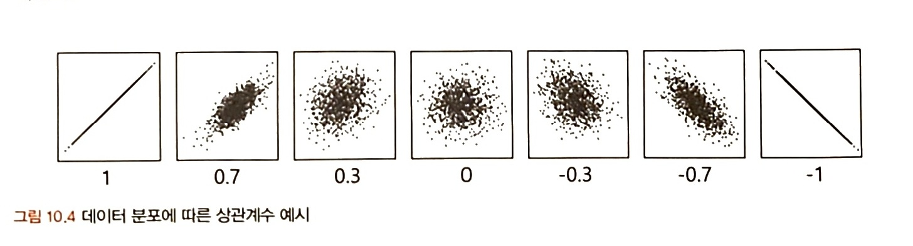
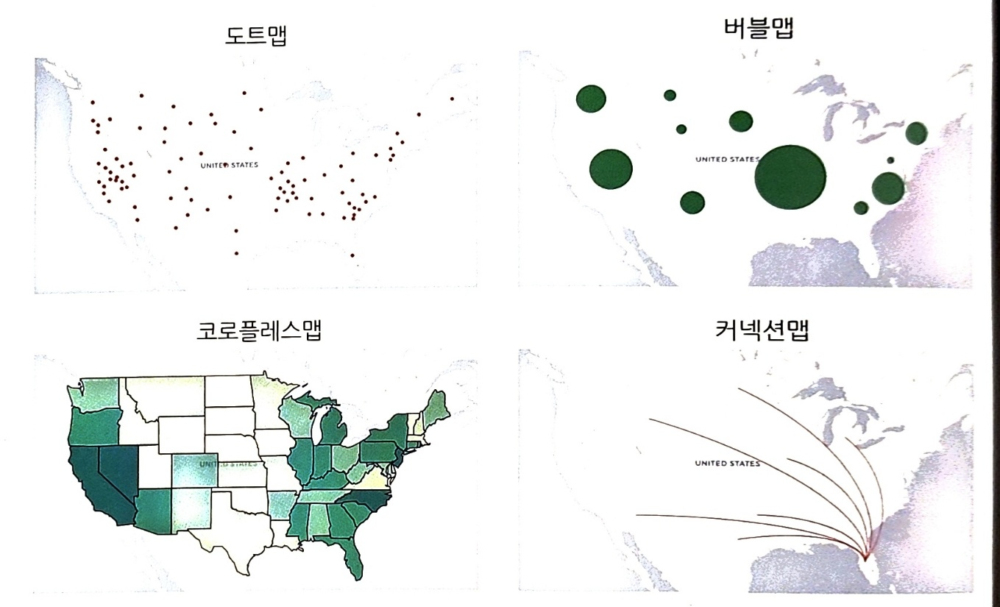
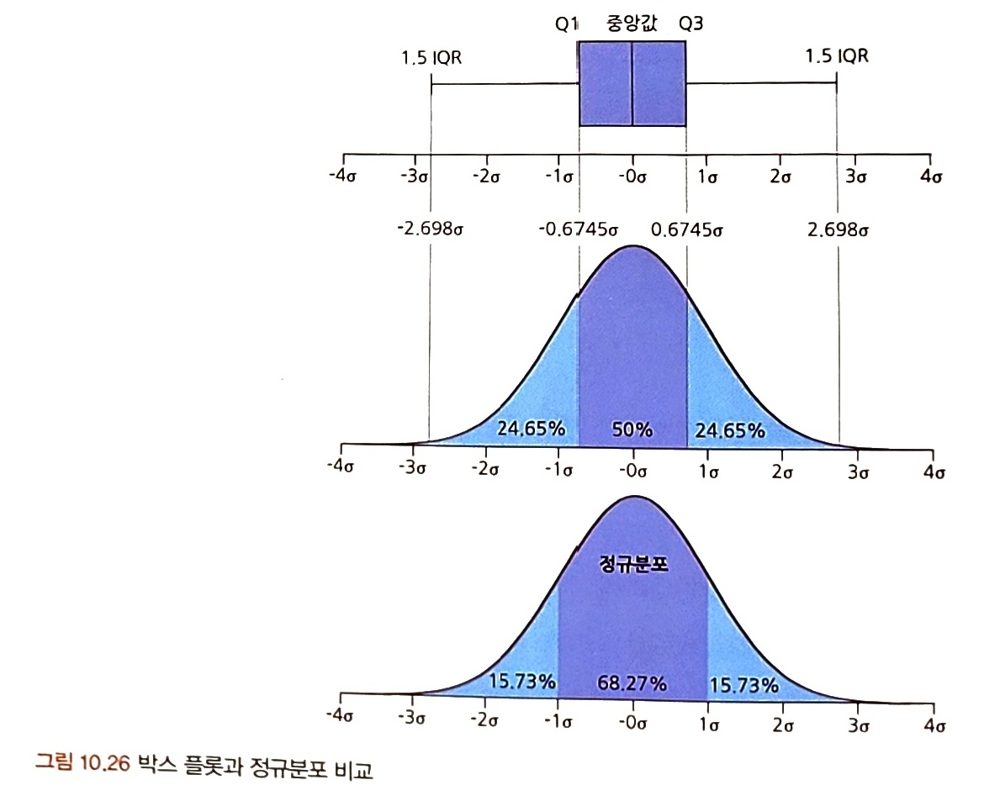

# 통계학 3주차 정규과제

📌통계학 정규과제는 매주 정해진 분량의 『*데이터 분석가가 반드시 알아야 할 모든 것*』 을 읽고 학습하는 것입니다. 이번 주는 아래의 **Statistics_3rd_TIL**에 나열된 분량을 읽고 `학습 목표`에 맞게 공부하시면 됩니다.

아래의 문제를 풀어보며 학습 내용을 점검하세요. 문제를 해결하는 과정에서 개념을 스스로 정리하고, 필요한 경우 추가자료와 교재를 다시 참고하여 보완하는 것이 좋습니다.

3주차는 `2부-10.데이터 탐색과 시각화`를 읽고 새롭게 배운 내용을 정리해주시면 됩니다.

[실습코드](https://github.com/c-karl/DA_DS_Book001)를 참고하여 학습해주세요.


## Statistics_3rd_TIL

### 2부. 데이터 분석 준비하기
### 10. 데이터 탐색과 시각화


## Study Schedule

|주차 | 공부 범위     | 완료 여부 |
|----|--------------|----------|
|1주차| 1부 ~p.79    | ✅      |
|2주차| 2부 ~p.120   | ✅      | 
|3주차| 2부 ~p.202   | ✅      | 
|4주차| 2부 ~p.299   | 🍽️      | 
|5주차| 3부 ~p.356   | 🍽️      | 
|6주차| 3부 ~p.437   | 🍽️      | 
|7주차| 3부 ~p.542   | 🍽️      | 
|8주차| 3부 ~p.615   | 🍽️      | 
|9주차|데이터 분석 실습| 🍽️      |

<!-- 여기까진 그대로 둬 주세요-->

# 10. 데이터 탐색과 시각화

```
✅ 학습 목표 :
* EDA: 데이터를 탐색하고 이상치, 누락값, 분포 등을 파악하여 데이터의 특성을 이해할 수 있다.
* 공분산과 상관분석: 공분산과 상관계수를 계산하고, 두 변수 간의 관계를 해석할 수 있다.
* 시각화: 데이터의 분포와 관계를 다양한 시각화 기법(히스토그램, 산점도, 박스플롯 등)을 통해 효과적으로 표현할 수 있다.
```
<!-- 새롭게 배운 내용을 자유롭게 정리해주세요.-->

## 10.1. EDA

GIGO: 가치가 없는 잘못된 데이터를 사용하면 결과 역시 무가치하다.

EDA 단계에서 데이터 파악을 효율적으로 하기 위해 시각화를 하기도 하지만, 데이터 시각화의 궁극적인 목적은 분석 결과를 커뮤니케이션하기 위함이다.(설득력 있는 결과 제시) 시각화는 목적에 따라 맞는 방법을 사용해야 설득력 생김.

```
# EDA: raw data를 있는 그대로 탐색하고 분석하는 기법
       기술통계와 데이터 시각화를 통해 데이터 특성 파악
       극단적 해석x, 지나친 추론x, 자의석 해석x
       기초통계지식이 빛을 발하는 단계

# EDA의 목적
- 데이터의 형태와 척도가 분석에 알맞게 되어 있는지 확인
- 데이터 특성 파악: 데이터의 평균, 분산, 분포, 패턴 확인
- 데이터의 결측값이나 이상치 파악 및 보완
- 변수 간의 관계성 파악
- 분석 목적과 방향성 점검 및 보정
```

### 10.1.1. 엑셀로 EDA

EDA 방법 중 가장 간단하면서 효과적인 방법은 각 데이터 샘플을 1,000개씩 뽑아서 엑셀에 붙여 놓고 변수와 설명 리스트를 함께 눈으로 쭉 살펴보는 것

다른 데이터들과 차이가 있는 데이터들만 따로 리스트화해서 실무자들과 미팅을 통해 해결할 수 있음.

PIVOT 테이블, 그래프 등을 생성하여 직관적으로 데이터를 파악할 수도 있다.

적은 데이터를 다룰 때에는 엑셀이 가장 사용자 친화적이고 효율적임.

### 10.1.2. EDA 실습

[데이터 시각화를 위한 python 패키지]   
1. seaborn: 시각화
2. matplotlib.pyplot 모듈의 각각의 함수를 사용해서 간편하게 그래프를 만들고 변화를 줄 수 있다.
3. pandas: 표 형식의 데이터를 다루는데 특화된 자료구조인 Series와 DataFrame의 기능을 제공하는 파이썬 패키지

[EDA 실습](https://github.com/ejejbb/Statistics_TIL/blob/main/%EC%9A%B4%EC%98%81%EC%A7%84%20%EC%8A%A4%ED%84%B0%EB%94%94/10_1_2_EDA_%EC%8B%A4%EC%8A%B5.ipynb)


## 10.2. 공분산과 상관성 분석

X와 Y의 관계 확인   
X들끼리의 관계 확인 -> 다중공선성 방지

```
[변수 간 상관관계 파악하기]

상관분석을 하려면 데이터가 양적척도(등간, 비율)이면서
두 변수가 선형적 관계라는 기본 가정을 둔다.

# 공분산: 서로 공유하는 분산 => 두 분산의 관계 => 두 변수의 공통적인 분산의 정도
- 0 : 두 변수는 상관관계가 없다.
- 음의 상관관계: 두 변수는 음의 선형관계를 가짐.
- ±1 : 완벽한 직선 관계
- 얼마나 상관성이 높은지 평가하기 어려움
  (공분산의 크기가 상관성의 정도를 나타내지 못함)

# 상관계수
- 공분산을 정규화
- 범위: -1부터 1
- 절댓값 0.7 이상: 상관관계가 매우 높음
- 절댓값 0.4 이상: 어느 정도 상관관계가 있음
- 산점도의 기울기와 상관계수는 무관 (선형성을 나타냄)
- 결정계수 = 상관계수^2 = 총 변동 중 회귀선에 의해 설명되는 변동이 차지하는 비율
```

[공분산 공식]

<br>

[상관계수 공식, 해석]
 | 
|---|---|

[상관계수 시각화]

<br>

[공분산, 상관관계 실습](https://github.com/ejejbb/Statistics_TIL/blob/main/%EC%9A%B4%EC%98%81%EC%A7%84%20%EC%8A%A4%ED%84%B0%EB%94%94/10_2_3_%EA%B3%B5%EB%B6%84%EC%82%B0%EA%B3%BC_%EC%83%81%EA%B4%80%EA%B4%80%EA%B3%84_%EC%8B%A4%EC%8A%B5.ipynb)

## 10.3. 시간 시각화

시간의 흐름에 따른 데이터의 변화를 표현
- 연속형: 선그래프 형태, 시간 단위의 밀도가 높을 때, 추세선을 삽입하여 데이터의 흐름을 안정된 선으로 표현 가능
  - 추세선은 이동평균(MA)을 이용하는 것이 가장 일반적임
- 분절형: 막대그래프/누적막대그래프/점그래프 등으로 표현

[시간 시각화 실습](https://github.com/ejejbb/Statistics_TIL/blob/main/%EC%9A%B4%EC%98%81%EC%A7%84%20%EC%8A%A4%ED%84%B0%EB%94%94/10_3_1_%EC%8B%9C%EA%B0%84_%EC%8B%9C%EA%B0%81%ED%99%94_%EC%8B%A4%EC%8A%B5.ipynb)

## 10.4. 비교 시각화

그룹별 차이를 나타내기 위한 시각화로 데이터가 간단하다면 (누적) 막대그래프만으로도 충분히 표현 가능하지만, 그룹별 요소가 많아지게 되면 효율적인 방법을 이용하여 시각화해야 한다.

**히트맵 차트**는 다른 시각화 방법에 비해 그리는 것이 까다롭기 때문에 현재 갖고 있는 데이터의 구조와 자신이 확인하고자 하는 목적을 정확히 파악한 다음 차트를 그려야 한다.

**방사형 차트**는 하나의 차트에 하나의 그룹을 시각화 할 수도 있고 모든 그룹을 한 번에 시각화 할 수도 있다.

**평행 좌표 그래프**는 방사형 차트에 있던 값들을 평행으로 펼쳐 나타낸 것이라고 생각하면 된다. 보다 효과적으로 표현하려면 가장 낮은 값을 0%로, 가장 높은 값을 100%로 변환하여 차이를 부각시킬 수 있다. 각 그룹의 요소별 차이 수준을 효과적으로 파악할 수 있고, 집단적 경향성을 표현하는 데에 용이하다.

[비교 시각화 실습](https://github.com/ejejbb/Statistics_TIL/blob/main/%EC%9A%B4%EC%98%81%EC%A7%84%20%EC%8A%A4%ED%84%B0%EB%94%94/10.4.1.%EB%B9%84%EA%B5%90%20%EC%8B%9C%EA%B0%81%ED%99%94.ipynb)

## 10.5. 분포 시각화

변수들이 어느 요소로 어느 정도의 비율로 구성되어 있는지 확인해야 한다.

- 양적 척도: 막대그래프, 선그래프, 히스토그램
- 질적 척도: 파이차트, 도넛차트, 트리맵차트(위계구조 표현 가능), 와플차트

[분포 시각화 실습](https://github.com/ejejbb/Statistics_TIL/blob/main/%EC%9A%B4%EC%98%81%EC%A7%84%20%EC%8A%A4%ED%84%B0%EB%94%94/10_5_1_%EB%B6%84%ED%8F%AC_%EC%8B%9C%EA%B0%81%ED%99%94.ipynb)

## 10.6. 관계 시각화

공분산과 상관분석을 통해 변수 간 관계를 시각화 -> 산점도

산점도를 그릴 때에는 극단치를 제거하고 그리는 것이 좋음.

데이터가 너무 많아서 점들이 서로 겹쳐 정보를 제대로 확인하기 어려운 경우 점에 투명도를 주어 점들의 밀도도 함께 표현 가능.

버블차트를 이용하면 세 가지 요소의 상관관계를 표현할 수 있음. 원의 면적을 함께 봐야 하기 때문에 관측치가 너무 많으면 정보 전달의 효율이 감소. 버블차트는 원의 지름이 아니라 면적을 통해 크기를 판단하므로 해석에 유의해야 함.(만일 지름이 2배 -> 4배 차이남.)

## 10.7. 공간 시각화

데이터가 지리적 위치와 관련되어 있다면 실제 지도 위에 데이터를 표현하는 것이 효과적이다. 위도와 경도를 지도에 매핑하여 시각화하는 것이 좋음.

스토리라인을 잡고 시각화하는 것이 효과적.

도트맵, 코로플레스맵, 버블맵, 컨넥션맵 등 사용 가능.

<br>

## 10.8. 박스 플롯

박스플롯은 하나의 그림으로 양적 척도 데이터의 분포, 편향성, 평균, 중앙값 등 다양한 수치를 보기 쉽게 정리해 준다. 특히 두 변수의 값을 비교할 때 효과적임. 대체적인 분포 형태를 쉽게 확인 가능. 5개의 대표적인 수치를 시각화.(min, Q1, Q2, Q3, max  +outlier경계)


<br>


<br>
<br>

# 확인 문제

## 문제 1.
> **🧚 공분산과 상관계수의 차이점에 대해 간단히 설명하세요.**

```
# 공분산은 두 변수 간의 선형 관계를 측정하며, 단위가 있다(두 변수의 단위 곱).
# 상관계수는 공분산을 표준화한 값으로, 단위가 없으며 항상 -1과 1 사이의 값을 가진다.
```

## 문제 2.
> **🧚 다음 데이터 분석 목표에 적합한 시각화 방법을 보기에서 모두 골라 연결해주세요.**

> 보기: 산점도, 선그래프, 막대그래프, 히스토그램, 박스플롯, KDE

(a) 변수의 분포 확인   
(b) 두 변수 간의 관계 확인   
(c) 집단별 평균 비교   
(d) 시계열 데이터 분석

```
(a) 히스토그램, KDE, 박스플롯  
(b) 산점도, 박스플롯  
(c) 막대그래프, 박스플롯, 산점도  
(d) 선그래프, 산점도  
```

### 🎉 수고하셨습니다.
