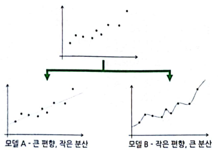
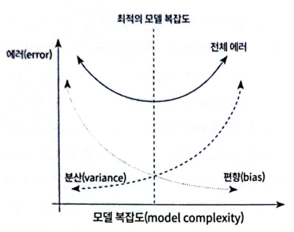
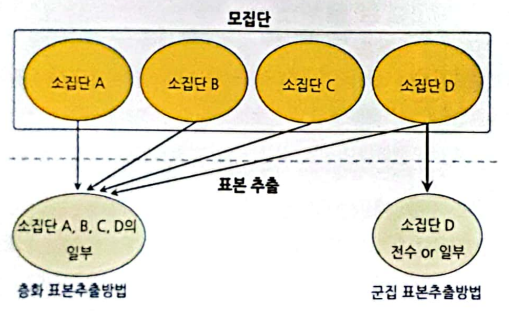
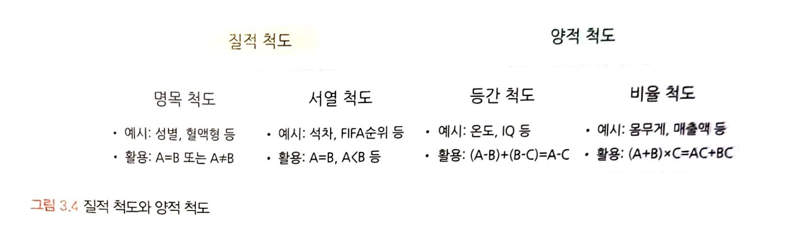
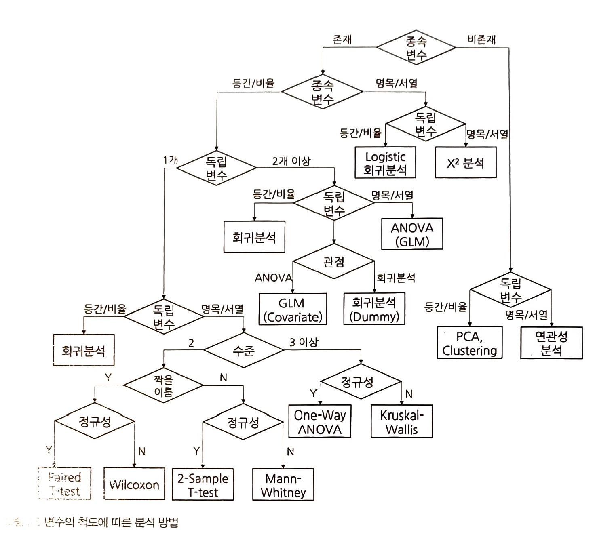

# 1부. 데이터 기초체력 기르기

## 01. 통계학 이해하기
```
[목표]
* 통계학적 소양이 필요한 이유를 안다.
* 통계학의 정의와 기원
* 기술통계와 추론통계의 특성을 구분하여 이해한다.
```
### 1.1. 왜 통계학을 알아야 할까?
데이터 과학은 기초 통계로부터 발전해 왔으며, 그 의미를 해석함에 있어서도 통계 이론에 기반해야 한다. 통계학 기본기가 충족되지 않은 상태에서 데이터 과학을 하는 것은 분석 결과가 진정 의미가 있는 것인지, 잘못된 부분은 없는지, 있다면 어떻게 개선해야 하는지를 알 수 없기 때문에 위험하다. 즉 데이터를 효과적으로 다루고자 한다면 통계학적 사고가 필요하다.

```
[일반적인 데이터 과학의 프로세스]
데이터 수집 > 데이터 가공 > EDA 및 시각화 > ML 모델링 > 결과 해석 및 적용
```

EDA를 하는 과정에서 데이터의 분포, 연관성, 확률 등을 통계적으로 깊이 있게 분석한다. 그래야 효과적인 머신러닝 모델을 기획하고 적용할 수 있다.

특히 우리가 궁금해하는 현상의 원인을 찾아내고 미래를 예측하기 위해서는 가설을 설정하고 통계적인 분석을 통해 가설을 검정해야 한다.

통계학에서 기본이 되는 기술 통계 개념(평균, 분산, 표준편차)과 데이터 분석을 할 때 기존 데이터에 대하여 이런 다양한 통계량을 어떻게 해석하는지 알아볼 것이다.

### 1.2. 머신러닝과 전통적 통계학의 차이

#### 1. 머신러닝   
예측이 주된 목적이므로 예측력이 얼마나 높은가에 집중한다. 따라서 분석 모형의 복잡성이 높으며, 고질적 문제인 과적합(overfitting) 해결에 집중한다.

#### 2. 전통적 통계학
해석이 주된 목적이고 모델의 신뢰도를 중시하며 단순성을 추구한다. 모집단에서 추출한 샘플에 대한 가정을 바탕으로 통계적 모델에 대한 적합성에 집중한다.

통계학은 모델의 기초 체력과 같은 것이고 이를 바탕으로 복잡하고 정교한 머신러닝 모델을 만드는 것이다.


### 1.3. 통계학의 정의와 기원

데이터는 의미 있는 형태인 '정보'로 전환됐을 때 의사결정에 도움이 될 수 있다. 나열된 정보를 표로 정리하여 알아보기 쉽게 시각화하는 것도 의미 있는 정보가 될 수 있다.

```
[통계학의 역사]

영국 - 패티의 인구통계표, 핼리의 보험수학과 생명표
독일 - 콘링의 국정론(국가적 요소들을 통계적으로 정리)
프랑스 - 베르누이, 가우스, 라플라스

골턴의 회귀분석 - 인류학자, 종의기원에서 영향
칼 피어슨의 수리통계학 - 상관계수(correlation coefficient)
존 튜키의 데이터 분석 - EDA
```
```
[확률모형]
함수로 규정되는 수리모형에서 오차가 추가된 개념
```


### 1.4. 기술 통계와 추론 통계

기술통계와 추론통계는 데이터를 통해 얻고자 하는 목적이 무엇인가에 따라 구분된다.

#### 1.4.1. 기술 통계  
: 주어진 데이터의 특성을 사실에 근거하여 설명하고 묘사하는 것. 가장 기본적인 방법은 그 데이터의 대푯값을 설명하는 것. 시각화를 많이 사용.
```
[대푯값]
평균, 중앙값, 최빈값 등

기술통계를 나타내는 것을 데이터 과학에서는 EDA라고 한다. 이러한 과정을 통해 날것의 데이터를 의사결정을 위한 정보로 탈바꿈하는 것이다.
```

#### 1.4.2. 추론 통계  
: 표본 집단으로부터 모집단의 특성을 추론하는 것
```
표본의 특성 분석 > 특성의 일반화 여부 판단 > 모집단의 특성으로 추정
```


## 02. 모집단과 표본추출
```
[목표]
* 표본으로 모집단의 특성을 추정 및 검정하는 방법에 대해 알아보자.
* 표본 추출 방법들과 이 과정에서 발생하는 편향들에 대해 알아보자.
* 편향을 최소화하는 방법을 확인하고 효과적으로 표본 추출하는 방법을 익히자.
```
### 2.1. 모집단과 표본, 전수조사와 표본


<br>

최대한 모집단의 특성을 반영할 수 있도록 표본을 추출할 수 있어야 한다.

### 2.2. 표본조사를 하는 이유와 데이터과학 적용 방법

일반적으로 최소 200개 이상의 표본이 확보되면 모수와 표본 통계량의 차이가 거의 없어진다. 하지만 변수의 개수나 표본분산에 따라 더 많은 표본이 필요할 수 있다. 통계적으로 변수 하나당 최소 30개의 관측치가 필요하다. 

```
[표본집단 수 -> 모집단 수]

ex. 관악구에 살고 있는 길고양이가 총 몇 마리인지 알아내기

우선 관악구의 길고양이 중 일부, 예를 들어 100마리를 포획한다. 그리고 포획한 100마리를 알아볼 수 있는 표식을 남기고 다시 풀어준다. 그리고 며칠 후 다시 무작위로 100마리의 길고양이를 포획한다. 그러면 일부는 저번에 남겼던 표식이 있을 것이다.
```

$$
{100\over N} \approx {n\over 100}
$$

```
두 번째로 포획했던 100마리 길고양이 중 표식이 남아있는 n마리의 길고양이가 만일 10마리라면, 아래의 수식에 따라 N은 1,000으로 추정되므로 관악구의 길고양이의 수(모집단의 수)는 1,000마리라고 추정할 수 있다.
```

### 2.3. 표본추출에서 나타나는 편향의 종류

* 표본오차: 모집단과 표본의 자연 발생적인 변동
* 비표본오차: 표본 오차를 제외한 변동
* 편향: 비표본오차의 원인 중 하나, 표본에서 나타나는 모집단과의 체계적 차이
```
[표본 추출 과정에서 발생하는 편향]

# 표본추출편향: 표본 추출 과정에서 체계적 경향이 개입
ex. 전화 보급 대중화 전 전화 여론조사 > 부유한 가정 위주의 표본

# 가구편향: 부분 집단 단위에서 하나의 관측치씩 추출하는 경우 발생하는 편향
ex. 각 가구의 집 전화를 통해 여론조사를 실시하는 경우, 가족구성원이 많은 가정의 사람이 가족구성원이 적은 가정의 사람보다 추출될 확률이 줄어 전체적인 표본 균형이 맞지 않는 결과가 발생

# 무응답편향: 응답자와 비응답자 사이에 체계적 차이가 있는 경우
ex. 시간적 여유가 있어서 설문에 쉽게 응하는 사람과 바빠서 응답을 하지 않는 사람 간 차이가 있을 수 있음

# 응답편향: 설문 형식의 문제, 응답자의 심리적 이슈에 의해 표본이 영향을 받는 경우
ex. 선거 당일 출구조사에서, 설문자가 사회적 시선이나 여론의 분위기 때문에 일부러 거짓말을 하는 경우(브래들리 효과) 
```

이러한 표본 편향은 확률화(randomizaiton) 등의 방법을 통해 최소화하거나 없앨 수 있다.


### 2.4. 인지적 편향의 종류

앞장에서는 표본추출의 단계에서 수반되는 편향들에 대해 알아보았고, 이번에는 분석가의 성향이나 상황에 따라 비논리적인 추론을 내리는 패턴인 '인지적 편향'에 대해 알아보자.

```
[대표적인 인지적 편향]

# 확증 편향
자신이 본래 믿고 있는 대로 정보를 선택적으로 받아들이고 임의로 판단하는 편향
분석가가 원하는 가설에 유리한 방향으로 정보를 수집하고 해석하는 것을 '데이터를 마사지한다'라고 표현한다.

# 기준점 편향
분석가가 가장 처음에 접하는 정보에 지나치게 매몰되는 편향

# 선택 지원 편향
확증 편향과 유사
**본인이 의사결정을 내리는 순간** 그 선택의 긍정적인 부분에 대해 더 많이 생각하고 그 결정에 반대되는 증거를 무시하게 되는 편향

# 분모 편향
분수 전체가 아닌 분자에만 집중하여 현황을 왜곡하여 판단하게 되는 편향
비율로 판단하는 것이 중요
주의할 점은 비율도 분모 편향의 영향을 받을 수 있다는 점임. 예를 들어 1990년대 국내 은행 평균 예금 금리는 10% 안팎. 그러나 물가 상승률을 분모로 적용하면 1990년대의 금리가 결코 2020년대보다 훌륭하다고 할 수 없다.

# 생존자 편향
소수의 성공한 사례를 일반화된 것으로 인식함으로써 나타나는 편향
ex. 제2차 세계대전 당시 전장에서 돌아온 전투기들의 총탄 자국을 분석하여 취약한 부분을 보강하기로 하였다. 엔지니어들은 외상이 많은 부분에 추가 장갑을 덧대면 생존율이 높아질 것이라고 했으나 연구원은 전장에서 돌아온 전투기들은 치명적인 부분에 총탄을 덜 맞았기 때문에 돌아올 수 있었던 것이라고 분석하였다. 
```

### 2.5. 머신러닝 모델 측면의 편향과 분산

편향이 머신러닝 모델에서 어떻게 나타나는지 아는 것도 상당히 중요하다.
* 편향   
: 예측값들이 정답과 일정하게 차이가 나는 정도   
: 실제값과 예측값의 차이
* 분산   
: 주어진 데이터 포인트(예를 들어 평균)에 대한 모델 예측의 가변성   
: 예측값들의 변동성


<br>


```
# 모델 A: 정답 값을 대략적으로 예측
# 모델 B: 정확히 예측
```

편향과 분산은 trade-off 관계


<br>

### 2.6. 표본 편향을 최소화하기 위한 표본 추출 방법

```
[표본 추출]

1. 데이터 수집 단계의 표본 추출
> 일반적인 통계 서적에서 다루는 표본 추출

2. 기업이 이미 갖고 있는 빅데이터에서 분석 모델링을 위한 적절한 크기의 표본 데이터를 추출
> 실무에서 사용하는 표본 추출
```

```
[확률 표본추출방법]

# 단순 임의 추출방법
random, 모집단에 대한 사전지식이 없는 경우 유용한 방법

# 계층적 표본추출방법
모든 구성단위에 일련번호를 부여한 뒤 일정한 간격으로 표본을 선택하는 방법

# 층화 표본추출방법
모집단이 특정 기준으로 분류 가능할 때 유용한 방법
단순 임의 추출방법으로 표본을 선정하는 경우 표본이 편중될 수 있는 위험을 보완

# 군집 표본추출방법
층화 표본추출방법처럼 특정한 기준으로 모집단을 분류한 뒤, 그 중 하나의 소집단을 선택하여 분석하는 방법
모집단이 방대한 상황에서 표본추출이 쉽지 않은 경우 유용한 방법
```


<br>


```
[복원추출과 비복원추출]

# 복원추출: 동일한 표본이 중복해서 선택될 수 있음
# 비복원추출: 표본을 추출하면, 다음 표본 추출 확률에 영향을 줌

일반적으로 모집단에 비해 추출하려는 표본의 양이 작으면 복원추출이나 비복원추출이나 차이가 거의 없다. 하지만 모집단의 크기가 별로 크기 않거나 추출하는 표본이 20% 이상으로 많은 경우에는 복원추출 방식이 편향을 더 줄일 수 있다.
```


## 03. 변수와 척도
```
[목표]
* 독립변수, 종속변수 개념 이해하기
* 인과관계, 상관관계, 의사관계 알아보기
* 척도(변수의 데이터적 속성)의 종류 알아보기
```
### 3.1. 변수의 종류

변수는 연산을 하는 것이 의미가 있는가에 따라 양적변수와 질적변수로 구분된다.
* 양적변수
    - 이산변수: 사람의 수, 휴대폰 판매량과 같이 정숫값만 취할 수 있는 변수
    - 연속변수: 길이나 무게처럼 연속적인 모든 실숫값을 취할 수 있는 변수
* 질적변수: 성별, 종교, 직업 등과 같은 비계량적 변수. 속성을 숫자로 변환하더라도 수치적 의미는 가지고 있지 않다.

변수의 관계적 측면으로 보면, 독립변수와 종속변수가 관계의 핵심이다. 이 둘은 원인과 결과의 관계이다.
```
[독립변수와 종속변수의 다양한 명칭]

# 독립변수 = feature
          = input variable
          = 설명변수
# 종속변수 = target variable
          = outcome variable
          = 반응변수
```

독립변수와 종속변수는 기본적으로 서로 상관관계를 갖고 있다.(단순한 상관관계가 아니라 인과관계를 갖고 있어야 한다.) 유의할 점은 독립변수 간에도 상관관계를 가질 수 있다는 점이다. 독립변수 간에는 상관관계가 없어야 한다. 독립변수 간의 상관관계가 높으면(**다중공선성** 문제) 독립변수들과 종속변수와의 연관성을 측정하기 어렵다.


```
# 통제변수: 실험이나 설문조사를 할 때 종속변수에 영향을 줄 수 있는 외부 요소를 통제하기 위해 사용되는 변수
```

### 3.2. 변수 관계의 종류

변수 간의 관계가 항상 단순한 인과관계만 있지는 않을 것이다. 인과관계 외에도 상관관계, 독립관계, 의사관계, 양방향적 인과관계, 조절관계, 매개관계 등이 있다.
```
# 상관관계: 변수 간 관련성이 존재하는 관계. 인과관계의 상위개념.

# 독립관계: '상관계수 = 0'인 관계

# 의사관계: 변수 간 상관성은 있지만, 그 상관성이 다른 변수에 의해 나타난 관계
ex. 일별 아이스크림 판매량과 익사사고 발생 수에 높은 상관관계가 나타났다고 하자. '기온'이라는 제3의 변수와의 관계 때문이다.

# 양방향적 인과관계: 두 변수가 서로 간에 인과적 영향을 미치는 관계
ex. A 기업의 투자금과 매출액의 관계
초기투자 > 매출액 증가 > 후기투자 > 매출액 증가

# 조절관계: 독립변수와 종속변수 사이에서 강하고 불확정적인 영향을 미치는 관계, 독립변수와 종속변수 간 관계의 강도를 조절해주는 역할
ex. 직원들의 업무만족도에 따른 기업매출의 변화를 알아보는 모델에서 '성별' 변수 추가

# 매개관계: 독립변수와 종속변수의 중간에서 개입하여 독립변수의 영향을 종속변수에 전달하는 관계. 따라서 매개관계에서는 시간적 차원이 포함되어 있다. 매개관계는 조절관계와 달리 독립변수, 종속변수와 직접 영향을 주고 받으며 독립변수의 영향을 종속변수로 전달하는 역할을 한다.
```

### 3.3. 척도의 종류

원활한 데이터 분석을 하기 위해서는 데이터를 통계적 분석이 가능하도록 객관적 척도로 변환하는 작업이 우선되어야 한다. 척도는 측정하고자 하는 대상을 수치화하는 것에 사용되는 일종의 측정 도구이다.


<br>

```
우선 변수가 질적/양적이나에 따라 질적척도(범주형)와 양적척도(연속형)로 분류된다.

# 질적척도
## 명목척도(nominal): 속성값을 범주로 나타냄, 다른 척도들보다 정보량이 가장 적다.
## 서열척도: 속성값을 순위로 나타냄, 대상 간 순위와 우위에 대한 정보를 포함

# 양적척도
## 등간척도: 서열척도가 갖고 있는 정보와 함께 조사대상이 갖고 있는 속성의 상대적 크기의 차이를 비교 가능
## 비율척도: 가장 많은 정보를 담을 수 있는 척도. 절대적 기준을 통한 비율 정보까지 포함. 가감승계가 모두 가능.
```

데이터 분석 프로젝트를 진행하게 되면 우선 적합한 분석 방법을 잘 선택해야 한다. 변수의 척도와 종속변수의 유무에 따라 적절한 분석방법을 선택하는 가이드라인을 확인해보자.


<br>