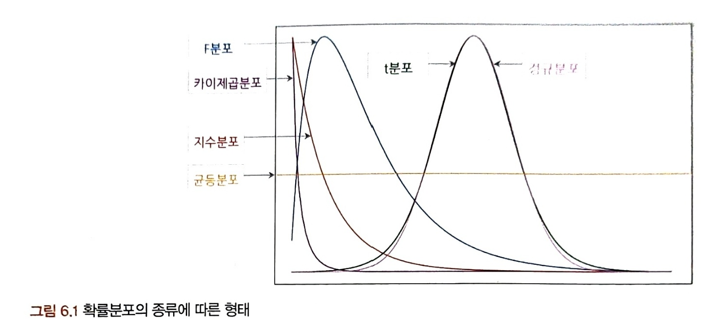
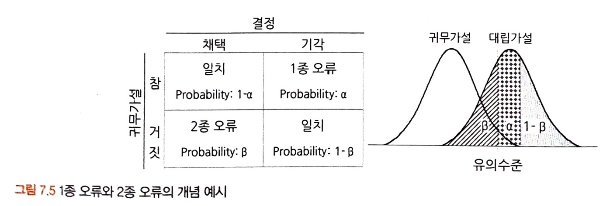

# 1부. 데이터 기초체력 기르기

## 04. 데이터의 기술 통계적 측정
```
[목표]
* 데이터의 기술통계적 측정을 위한 방법 알아보기
(평균, 최빈값, 중앙값, 분산, 표준편차, 산포도, 왜도, 첨도)
```
### 4.1. 중심 성향의 측정

데이터가 주어지고 변수 하나를 선택하여 주어진 데이터를 대표할 수 있는 하나의 값은 자료의 특성을 파악할 수 있는 것이어야 한다. 조사한 표본의 중심성향을 선택하는 것이 좋다. 중심성향에는 **평균값, 최빈값, 중앙값** 등이 있다.

```
[평균]

# 산술평균: 전체 합을 전체 수로 나누어 줌
# 가중평균: 가중치 반영
# 기하평균: 비율적으로 변화하는 값의 평균을 구할 때 사용
# 조화평균: 속도
```

### 4.2. 분산과 표준편차

```
# 분산: 편차 제곱의 산술평균
# 표준편차: 분산은 제곱값이므로 제곱근을 취하여 구한 값

# 자유도: 자유롭게 선택할 수 있는 숫자의 개수
-> 표본분산을 구하는 경우 관측치의 수(n)가 아닌 자유도(n-1)로 나눠줘야 함.
```

### 4.3. 산포도와 범위, 사분위수, 변동계수

```
# 산포도: 대푯값을 중심으로 자료들이 흩어져 있는 정도
        분산과 표준편차를 포괄하는 상위 개념

# 산포도 측정 방식: 범위, 분산, 표준편차, 사분위수 범위, 변동계수 등

## 범위(range): MAX-MIN

## 사분위수(quartile): Q1=하위25%, Q2=하위50%=중앙값, Q3=하위75%, Q4=하위100%=max

## IQR = Q3-Q1

## 변동계수(CV): 표준편차를 산술평균으로 나누어 준 값으로, 서로 다른 두 자료의 산포도를 비교할 수 있다. 단, 평균이 0이거나 0에 가까우면 CV가 무한히 커질 수 있다.
```

### 4.4. 왜도와 첨도

본격적인 데이터 분석을 시작하기 전에 각 변수의 데이터 분포를 살펴보는 것이 중요하다. 분포가 분석모델에 적절하지 않은 경우에는 사전 보정을 해줘야 하기 때문이다.

```
# 왜도(skewness): 비대칭도
- 정규분포처럼 좌우대칭일수록 왜도 절댓값은 작아짐
(정규분포의 왜도 값 = 0)
- 한쪽으로 몰려있으면 왜도 절댓값은 증가함
(왼쪽으로 치우침 - 양수 / 오른쪽으로 치우침 - 음수)
- 피어슨의 비대칭 계수
- 보통 0보다 작거나 3보다 크면 데이터가 정규성을 가지지 않는다고 판단 (참고용으로만 사용)

# 첨도(kurtosis): 정규분포보다 뾰족하고 완만한지의 정도
- 중심에 얼마나 집중적으로 쏠려 있는가를 측정
- 뾰족하면 첨도 증가, 완만하면 첨도 감소
- 정규분포의 첨도 값 = 3
```

### 4.5. 표준편차의 경험법칙

일반적인 정규분포에서는 표준편차를 통해 데이터 값들의 범위를 가늠할 수 있다.

A. 데이터의 약 68%는 평균으로부터 ±1σ 이내에 속한다.
B. 데이터의 약 95%는 평균으로부터 ±2σ 이내에 속한다.
C. 데이터의 약 99.7%는 평균으로부터 ±3σ 이내에 속한다.

정규분포의 경우 μ±3σ 내에 데이터의 약 99.7%가 속하므로 최댓값과 최솟값을 추정할 수 있다.

주어진 데이터가 정규분포가 아니거나 분포를 모를 경우 체비셰프의 정리에 따르면 μ±2σ 내에 75% 이상의 데이터가 존재하고 μ±3σ 내에 적어도 89%, μ±4σ 내에 적어도 94%가 존재한다.


## 05. 확률과 확률변수
```
[목표]
* 확률의 기본 개념
* 비조건확률, 조건부 확률
* 표본으로 모수를 추정하는 원리
* 이산확률변수와 연속확률변수
* 베이지안 이론과 심슨의 역설
```
### 5.1. 확률의 기본 개념

```
# 확률: 일정한 조건 안에서 특정 사건이 일어날 수 있는 가능성의 정도
- #사건/#시행
- 불확실성이 어느 정도인지 이해하기 위해 확률의 개념을 알 필요가 있음

# 표본공간(sample space): 통계적 실험을 통해 발생할 수 있는 모든 사건의 집합

# 사건(event): 한 번의 실험을 통해 발생할 수 있는 특정한 결과 혹은 표본공간의 부분집합 
```

### 5.2. 확률의 종류

```
# 비조건확률=한계확률
# 결합확률: 두 개 이상의 사건 조합으로 이루어지는 확률
# 조건부확률: 하나의 사건이 먼저 발생했다는 조건 하에 또 다른 사건이 발생할 확률
```

### 5.3. 분할과 베이지안 이론

5.3.1. 분할  
: mutually exclusive, collectively exhaustive
ex. 주사위를 던졌을 때 홀수가 나오는 사건과 짝수가 나오는 사건

5.3.2. 베이지안 이론

기업의 마케팅 캠페인 효과 측정, 상품 가격모델링 등 실무에서 다양하게 쓰임

```
P(A): A의 Prior Probability (A는 현재의 증거)
P(B): B의 Prior Probability (B는 과거의 경험)
P(B|A): A가 발생했을 때 B의 조건부 확률 (Likelihood)
P(A|B): Posterior Probability

"P(A)와 P(B|A)를 알면 P(A|B)를 계산할 수 있다."
```

### 5.4. 확률변수의 개념과 종류

```
# 확률변수: 측정 값이 변할 수 있는 확률이 주어진 변수

## 이산확률변수
## 연속확률변수
```

### 5.5. 심슨의 역설

데이터의 세부 비중에 따라 전체 대표 확률이 왜곡되는 경우가 있음. 데이터의 세부 그룹별로 일정한 추세나 경향성이 나타나지만, 전체적으로 보면 그 추세가 사라지거나 반대 방향의 경향성을 나타내는 현상이 심슨의 역설. 때문에 데이터를 어떻게 나누고 결합하고 가공하는가에 따라 결과가 정반대로 바뀔 수 있음을 경계해야 함.


## 06. 확률분포
```
[목표]
* 이산확률분포: 이항분포, 초기하분포, 포아송분포
* 연속확률분포: 정규분포, 지수분포
```
### 6.1. 확률분포의 정의와 종류

```
[대략적인 확률분포의 형태]
# 정규분포
# t분포: n이 커지면 정규분포에 수렴
# F분포
# 카이제곱분포
# 지수분포
# 균등분포
```

<br>

### 6.2. 이산확률분포

```
# 균등분포: 확률변수가 동일한 확률을 가지는 분포
(이산일 수도 연속일 수도 있음)

# 이항분포: 결과가 2가지 중 하나만 나오는 시행을 n번 하는 경우 사용, 각 시행은 독립

# 초기하분포: 결과가 2가지 중 하나만 나오는 시행을 n번 하는 경우 사용, 각 시행은 독립적이지 않음(비복원추출)

# 포아송분포: 일정한 관측 공간에서 특정 사건이 발생하는 횟수를 나타냄, 표본크기라는 개념이 존재하지 않음
ex. 보험상품개발 - 특정 연령대 구간에 평균적으로 몇 번의 교통사고를 당하는지

## 포아송분포의 조건
- 발생하는 사건은 양의 정수 형태
- 모든 사건은 독립
- 해당 시공간에서 사건의 발생 비율은 항상 같음 (시공간이 두 배로 늘어나면 발생하는 사건도 두 배로 늘어난다.)
- 한 번에 둘 이상의 사건이 발생하지 않는다.
```

### 6.3. 연속확률분포

연속확률분포는 확률변수가 특정 구간에 속할 확률을 구해야 한다.

```
# 정규분포: 평균을 중심으로 좌우 대칭의 종 모양 형태를 가지고 있으며 대부분의 분포를 정규분포에 근사하여 사용한다.

# 지수분포: 특정 사건이 발생한 시점으로부터 다음 사건이 발생할 때까지의 *시간*을 확률변수로 하는 확률분포, 확률변수인 시간이 증가할수록 사건 발생 확률이 지수적으로 감소
```

### 6.4. 중심극한정리

실제 데이터는 분포 형태가 다양하고 편중이 심한 경우도 자주 나타난다. 그러나 통계적 추론과 검증을 위한 대부분의 분석 모델은 데이터가 정규분포라는 가정하에 이루어진다. 이를 위한 개념이 중심극한정리(CLT)이다.

```
# 중심극한정리: 데이터의 크기가 일정한 양을 넘으면 각 표본의 평균의 분포가 정규분포에 근사한다는 이론
```

## 07. 가설검정
```
[목표]
* 귀무가설과 대립가설의 개념을 익히고 가설 설정부터 대립가설의 채택 및 기각까지 가설검정 절차를 살펴본다.
* 유의수준, p값
* 단측, 양측검정
* 1종 오류, 2종 오류
```
### 7.1. 귀무가설과 대립가설
```
# 가설: 검정하고자 하는 주제, 데이터 분석의 나침반 역할

# 귀무가설(Null hypothesis): 증명하고자 하는 가설과 반대되는 가설로써, 효과와 차이가 없는 가설

# 대립가설(Alternative hypothesis): 귀무가설이 기각됐을 때 대안적으로 채택되는 가설

-> 무죄 추정의 원칙과 같이 충분한 증거가 있기 전까지는 귀무가설이 옳은 것으로 가정하는 것임.
-> 대립가설이 참임을 증명하는 것보다 귀무가설이 참이 아님을 증명하는 것이 훨씬 쉽기 때문에 이러한 형식으로 가설을 설정하고 검정함.
```

### 7.2. 가설검정의 절차

```
[가설검정의 절차]
가설 설정 > 유의수준 설정 > 실험 수행 > 검정 통계량 산출 > 대립가설 기각/채택

# 유의수준: 귀무가설을 기각하거나 채택하는 것을 판단하기 위한 통곗값
ex. 유의수준=5% => 귀무가설이 참일 때 극단적인 표본이 나올 확률을 5%로 설정한 것
```

### 7.3. 가설검정의 유의수준과 p값

귀무가설에 대한 p값이 유의수준 안에 들어오는지에 따라 가설의 기각과 채택을 판별한다.
```
p값 < 유의수준 : 귀무가설 기각
p값 > 유의수준 : 귀무가설 채택
```
신뢰수준: 1 - 유의수준

되도록이면 양측검정보다 단측검정을 시행하는 것이 바람직하다. 단측검정은 방향성에 대한 정보가 포함되기 때문이다.

### 7.4. 1종 오류와 2종 오류

```
# 1종 오류: 귀무가설이 참인데 귀무가설을 기각하는 오류
(실제로 효과가 없는데 효과가 있다고 판단)
-> 1종 오류가 발생할 확률을 α로 나타냄
-> 복합 귀무가설의 경우 α는 1종 오류가 발생할 확률의 최대치를 의미

# 2종 오류: 귀무가설이 거짓인데 귀무가설을 채택하는 오류
(실제로 효과가 있는데 효과가 없다고 판단)
-> 2종 오류가 발생할 확률을 β로 나타냄
-> 검정력(power) = 1-β
-> 유의수준이 주어지면 표본이 늘어나지 않는 이상 자동으로 결정됨 (α와 β의 trade-off 관계)
```


<br>

일반적으로 유의수준은 0.05, 검정력은 0.2 기준을 사용하고, 1종 오류를 2종 오류보다 더 중요하게 생각한다. 실제로 효과가 없는데 효과가 있다고 판단하는 것은 잘못 판단하는 것이므로 문제가 더 커질 수 있다. 다만, 암진단과 같은 경우에는 2종 오류를 더 중요하게 생각하고 환자를 진단한다. 실제로 암에 걸렸는데 암에 걸리지 않았다고 판단한다면 치료 시기를 놓쳐 더 위험하기 때문이다. 따라서 가설을 설정하는 목적과 환경을 고려하고 극단적이지 않은 결과가 나오도록 세밀한 실험 설계를 해야 한다.