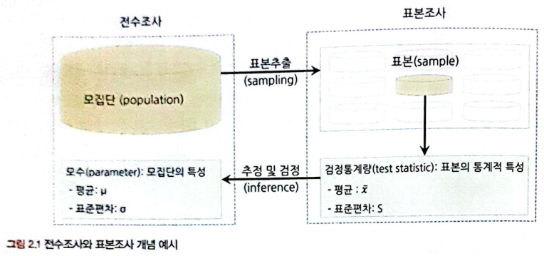

# 2부. 데이터 분석 준비하기

## 08. 분석 프로젝트 준비 및 기획
```
[목표]
* 데이터 분석의 프로세스 익히기
* 비즈니스 문제 정의와 분석 목적 도출 방법 알아보기
* 분석 목적의 전환 방법과 도메인 지식을 습득하는 노하우 알아보기
* 외부 데이터를 수집하는 데이터 구매, 오픈 데이터 수집, 크롤링 방법 알아보기
```
### 8.1. 데이터 분석의 전체 프로세스

```
[데이터 분석 3단계]
목표: 의사결정 프로세스 최적화하기

설계 > 분석 및 모델링 > 구축 및 활용

# 설계: 과제 정의 및 범위 설정

# 분석 및 모델링: 외부 데이터 수집 및 전처리, 데이터 분석 및 모델 도출, 모델 검증

# 구축 및 활용 단계: 모델 적용, 성과 평가
```
[분석 및 모델링 단계에서의 여러가지 방법론]
1. CRISP-DM 방법론


<br>

목표, 계획 수립 > 데이터 이해 > 데이터 준비 > 모델링 > 평가 > 보고 및 검토

2. SAS SEMMA 방법론

```
S(ampling): 데이터 추출

E(xploration): 데이터 탐색
-> 시각화로 데이터 탐색
-> 상관분석, 클러스터링 등을 통해 변수 관계 파악
-> 분석 모델에 적합한 변수 설정

M(odification): 변수 가공
-> 결측치 처리 및 최종 분석 변수 선정
-> 로그변환, 구간화 등 데이터 가공
-> PCA 등을 통해 새로운 변수 생성

M(odeling): 모델 구축

A(ssessment): 모델 평가
```

전체 과정은 무조건 단방향으로 진행되지 않음. 상황에 따라 왔다 갔다..

### 8.2. 비즈니스 문제 정의와 분석 목적 도출

데이터를 살펴보다 운 좋게 의미 있는 정보를 찾게 되어 성과를 낸다면 다행이겠지만, 목적이 불명확하다면 대부분 제대로 된 성과를 내지 못한다.

비즈니스 이해 및 문제 정의가 조금이라도 잘못되면 최종 인사이트 도출 및 솔루션 적용 단계에서 제대로 된 효과를 보기 힘들다. 심한 경우, 후반부에 와서 왜 이 프로젝트를 하는지 목적이 불분명해지기도 한다.

<br>

<br>

비즈니스 문제를 올바르게 정의하기 위한 논리적 접근법으로 가장 널리 쓰이는 방식이 MECE다. 이는 세부 정의들이 서로 겹치지 않고 전체를 합쳤을 때는 빠진 것 없이 완전히 전체를 이루는 것을 의미한다.

그렇다면 비즈니스 문제와 목적은 어떻게 해야 잘 정의할 수 있을까? 비즈니스 문제는 `현상에 대한 설명으로 끝나서는 안되고, 본질적인 문제점이 함께 전달`되어야 한다.

<br>

<br>

비즈니스 문제를 고객 이탈로 시작하는 경우, 이탈 고객 예측 모델을 만들게 된다. 반면 비즈니스 문제를 고객 이탈에 따른 수익 감소로 정의하는 경우, 프로모션 최적화 모델을 만들게 된다. 즉, `본질적인 문제를 명시`해야 제대로된 분석이 진행될 수 있다.

### 8.3. 분석 목적의 전환

분석 프로젝트는 데이터 탐색을 하기 전까지 데이터에 숨겨져 있는 정보와 인사이트를 확인하기 어렵다. 따라서 분석 프로젝트의 방향이 언제든 바뀔 수 있다는 것을 염두에 두어야 한다.

```
[필자의 경험 예시]
원재료 정제 필터 적정 교체시기 예측 모델 구축 프로젝트 진행
필터 교체와 절사 발생률 간 관계를 찾을 수 없었음.
분석 목적을 전환하여 원사 절사 개선 프로젝트로 바꿈.

=> 실무자들 간 커뮤니케이션 및 협력이 매우 중요
# 팁: 시각화 적극 활용하기
      단순한 데이터라도 시각화하여 실무자와 공유하고 그들과의 신뢰를 쌓는 것이 중요함.
```

### 8.4. 도메인 지식

```
[기업이 DA 역량을 기르기 위한 인력 충원 방법]

1. 데이터 분석가를 새로 고용 -> 시간, 비용 절약

2. 기존 실무자나 신입사원을 교육시켜 데이터 분석가로 만듦 -> 도메인 지식이 충분한 DA 양성 가능
```

```
# 도메인 지식: 업에 대한 이해도

도메인 지식이 없다면 문제 정의와 분석 목적이 1차원적일 수밖에 없다. 또한 분석 결과가 어떠한 의미를 가지는지, 어떻게 활용될 수 있는지 알기 힘들다.

ex. 배달앱에서 '국밥' 키워드 검색의 노출 순위 최적화
- 도메인 지식 x : 고객 성별, 연령 등을 기준으로 군집화하여 인기 있는 순으로 노출
- 도메인 지식 o : 지역별로 '국밥'하면 떠오르는 국밥의 종류가 다르기 때문에 지역별로 노출되는 국밥의 종류를 다르게 할 수 있음.

[도메인 지식을 효과적으로 습득하려면?]
1. 프로젝트 초반에 실무자와 잦은 미팅과 함꼐 적극적인 질문과 자료 요청을 할 것
2. 관련 논문들을 참고하여 해당 도메인에 대한 심도 있는 지식 습득하기
3. 현장에 방문에 데이터가 만들어지는 과정을 직접 보기, 어렵다면 실제 공정과 유사한 동영상을 요청하거나 유튜브 영상 검색
=> 데이터가 생성되는 현장을 직접 보고 소비자 혹은 사용자의 입장에 되어 경험을 해보는 것이 좋음.
```

### 8.5. 외부 데이터 수집과 크롤링

외부 데이터를 수집하기 위해서는 많은 시간과 비용, 노력이 소요되므로 데이터를 수집하기 전에 분석 목적을 명확히 정의해야 한다.

```
# 외부 데이터 수집: 정형, 반정형, 비정형 등 다양한 유형의 데이터를 수집

일반적으로 다수의 경로에서 다양한 데이터를 한꺼번에 수집한 다음
머신러닝 모델이나 분석 목적에 맞도록 통합, 가공 후 비즈니스에 활용

## 방법
1. 데이터 구매
2. 오픈 데이터 수집
3. 크롤링
: 해당 웹페이지가 리뉴얼되면 이제 맞춰 수집 코드를 수정해야 함
: 일반적으로 웹사이트에서는 robots.txt 파일을 심어 두어 접속 주체에 따라 크롤링 허용 범위를 안내하고 있다.
(대상 크롤러 / 허용 경로 / 허용하지 않는 경로)에 대한 정보를 포함.

* 스크래핑: 크롤링과 달리 웹 페이지에서 자신이 원하는 부분의 정보만 가져오는 것
```

```
[크롤링]
3-1. open api를 통해 정리된 데이터 제공받기
3-2. 직접 코딩
3-3. 파이썬에서는 BeautifulSoup나 Selenium 라이브러리 활용 가능

크롤링: 웹사이트의 html 구조를 활용하여 원하는 데이터가 있는 위치를 사전에 설정하여 자동으로 반복적으로 특정 위치에 있는 텍스트를 수집하는 것

크롬 브라우저에서 F12키를 누르면 개발자도구 열림
> 원하는 위치에 마우스 커서를 가져다 대면 해당 영역의 소스 코드가 노출됨
(수집하고자 하는 데이터의 구조적 위치를 확인)
> 복사된 위치를 파이썬 코드에 삽입하여 해당 위치의 텍스트를 수집
```


## 09. 분석 환경 세팅하기
```
[목표]
* 표본으로 모집단의 특성을 추정 및 검정하는 방법에 대해 알아보자.
* 표본 추출 방법들과 이 과정에서 발생하는 편향들에 대해 알아보자.
* 편향을 최소화하는 방법을 확인하고 효과적으로 표본 추출하는 방법을 익히자.
```
### 2.1. 모집단과 표본, 전수조사와 표본


<br>

최대한 모집단의 특성을 반영할 수 있도록 표본을 추출할 수 있어야 한다.