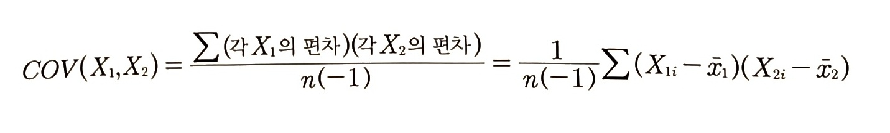
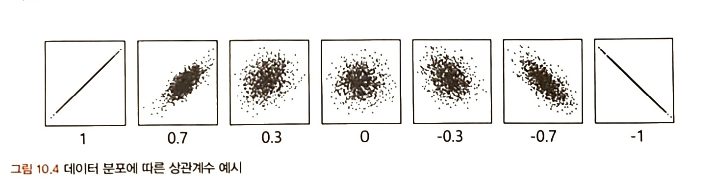

# 2부. 데이터 분석 준비하기

## 10. 데이터 탐색과 시각화
```
[목표]
* EDA
* 상관성 분석
* 시각화
```

GIGO: 가치가 없는 잘못된 데이터를 사용하면 결과 역시 무가치하다.

EDA 단계에서 데이터 파악을 효율적으로 하기 위해 시각화를 하기도 하지만, 데이터 시각화의 궁극적인 목적은 분석 결과를 커뮤니케이션하기 위함이다.(설득력 있는 결과 제시) 시각화는 목적에 따라 맞는 방법을 사용해야 설득력 생김.

### 10.1. EDA
```
# EDA: raw data를 있는 그대로 탐색하고 분석하는 기법
       기술통계와 데이터 시각화를 통해 데이터 특성 파악
       극단적 해석x, 지나친 추론x, 자의석 해석x
       기초통계지식이 빛을 발하는 단계

# EDA의 목적
- 데이터의 형태와 척도가 분석에 알맞게 되어 있는지 확인
- 데이터 특성 파악: 데이터의 평균, 분산, 분포, 패턴 확인
- 데이터의 결측값이나 이상치 파악 및 보완
- 변수 간의 관계성 파악
- 분석 목적과 방향성 점검 및 보정
```

#### 10.1.1. 엑셀

EDA 방법 중 가장 간단하면서 효과적인 방법은 각 데이터 샘플을 1,000개씩 뽑아서 엑셀에 붙여 놓고 변수와 설명 리스트를 함께 눈으로 쭉 살펴보는 것

다른 데이터들과 차이가 있는 데이터들만 따로 리스트화해서 실무자들과 미팅을 통해 해결할 수 있음.

PIVOT 테이블, 그래프 등을 생성하여 직관적으로 데이터를 파악할 수도 있다.

적은 데이터를 다룰 때에는 엑셀이 가장 사용자 친화적이고 효율적임.

#### 10.1.2. EDA 실습

[데이터 시각화를 위한 python 패키지]   
1. seaborn: 시각화
2. matplotlib.pyplot 모듈의 각각의 함수를 사용해서 간편하게 그래프를 만들고 변화를 줄 수 있다.
3. pandas: 표 형식의 데이터를 다루는데 특화된 자료구조인 Series와 DataFrame의 기능을 제공하는 파이썬 패키지

[EDA 실습](https://github.com/ejejbb/Statistics_TIL/blob/main/%EC%9A%B4%EC%98%81%EC%A7%84%20%EC%8A%A4%ED%84%B0%EB%94%94/10_1_2_EDA_%EC%8B%A4%EC%8A%B5.ipynb)


### 10.2. 공분산과 상관성 분석

X와 Y의 관계 확인   
X들끼리의 관계 확인 -> 다중공선성 방지

```
[변수 간 상관관계 파악하기]

상관분석을 하려면 데이터가 양적척도(등간, 비율)이면서
두 변수가 선형적 관계라는 기본 가정을 둔다.

# 공분산: 서로 공유하는 분산 => 두 분산의 관계 => 두 변수의 공통적인 분산의 정도
- 0 : 두 변수는 상관관계가 없다.
- 음의 상관관계: 두 변수는 음의 선형관계를 가짐.
- ±1 : 완벽한 직선 관계
- 얼마나 상관성이 높은지 평가하기 어려움
  (공분산의 크기가 상관성의 정도를 나타내지 못함)

# 상관계수
- 공분산을 정규화
- 범위: -1부터 1
- 절댓값 0.7 이상: 상관관계가 매우 높음
- 절댓값 0.4 이상: 어느 정도 상관관계가 있음
- 산점도의 기울기와 상관계수는 무관 (선형성을 나타냄)
- 결정계수 = 상관계수^2 = 총 변동 중 회귀선에 의해 설명되는 변동이 차지하는 비율
```

[공분산 공식]

<br>

[상관계수 공식, 해석]
 | 
|---|---|

[상관계수 시각화]

<br>

### 10.3. 시간 시각화

### 10.4. 비교 시각화

### 10.5. 분포 시각화

### 10.6. 관계 시각화

### 10.7. 공간 시각화

### 10.8. 박스 플롯